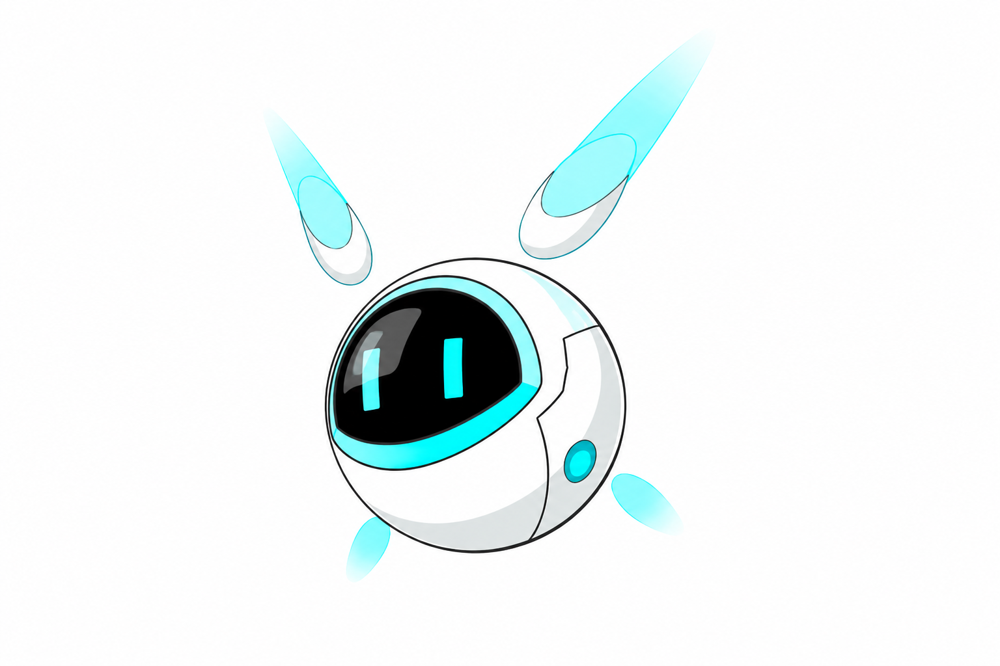

<p align="center">
  
</p>

<h1 align="center">Nono</h1>

<p align="center">
  Your little assistant — an agent that believes in the power of the base model.
</p>

<p align="center">
  
  
  
</p>

---

## What is Nono?

Nono is a small terminal agent built on one bet: **the base model is already strong enough**. Nono does not wrap it in elaborate planning graphs, multi-agent choreography, or prompt pyramids. It supplies the minimum scaffolding — a prompt, some history, a couple of tools — and gets out of the way.

What that looks like in practice:

- Talk to it in a terminal REPL, with replies streamed and rendered as Markdown as they arrive.
- It can call tools on its own (`bash`) in a loop, up to 8 rounds per message.
- Anything that mutates your machine asks permission first. Every time.
- Sessions live on disk as plain `.jsonl`, so you can read or `rm` your own history.
- Its persona lives in `configs/soul.md`, and it can rewrite that persona when you tell it something worth keeping.
- There is a tiny pet above the prompt line, because why not.

## Quick start

Requires **Python 3.11+**, **uv**, and **bash** on `PATH` (Git Bash on Windows). For the full animated UI use a real terminal — Windows Terminal or `cmd`; see [The desk pet](#the-desk-pet).

```bash
git clone <this-repo> && cd Nono

uv sync

cp .env.example .env   # then fill it in
```

`.env` takes three values:

```ini
NONO_BASE_URL=https://api.openai.com/v1
NONO_API_KEY=sk-...
NONO_MODEL=gpt-4o-mini
```

Any OpenAI-compatible endpoint works — swap the base URL for a local server, a proxy, another provider.

Then:

```bash
uv run nono
```

(`uv run python -m src.apps.cli` does the same thing.) Nono resumes your most recent session automatically if there is one.

## Using Nono

Type normally to talk. Slash commands handle everything else (they tab-complete):

| Command | What it does |
| --- | --- |
| `/tools` | List the tools Nono has, and which of them the model can call itself |
| `/workflow` | List workflows in `.workflows/` |
| `/workflow <name>` | Load that workflow into the current session |
| `/bash <command>` | Run a shell command yourself, under the same rules as the model |
| `/new` | Start a fresh session |
| `/clear` | Forget the current session's history, keeping the session file |
| `/resume` | Switch sessions, start a new one, or delete one (`d<number>`) |
| `/exit` | Quit |

Two flags:

```bash
uv run python -m src.apps.cli --no-pet        # no companion above the prompt
uv run python -m src.apps.cli --no-markdown   # stream replies as plain text
```

**Permissions.** `bash` splits the command line conservatively and checks every segment against a read-only allowlist (`ls`, `cat`, `grep`, `find`, `git status`, …). Read-only commands run immediately. Anything else — or anything involving redirection, command substitution, or `sudo` — prompts you before it runs. The parser is deliberately naive: it would rather ask one time too many than guess wrong. Output is capped at 10,000 characters and commands time out after 60 seconds.

The same rule covers the destructive slash commands: `/clear` and deleting a session both ask for a yes before touching anything.

When the model calls a tool mid-reply, Nono pauses the stream to ask you, then prints the tool call and a preview of its result before continuing.

## How it fits together

```
core/      LLM (one OpenAI-compatible wrapper)
           Nono (the reply loop: stream → tool calls → stream again)
           ContextManager (history on disk, prompt assembly, soul.md)
tools/     bash, update_soul, workflow — each does one thing
apps/      cli (the REPL) and pet (the companion)
```

### Core

- **LLM** — a thin wrapper over the OpenAI SDK. Streaming text plus accumulated tool-call fragments. Provider differences stop here.
- **Nono** — one turn is a loop: ask the model, stream it to you, run any tool calls it requested, feed results back, repeat up to 8 rounds. A turn that is interrupted (Ctrl-C) or fails is rolled back entirely, so the transcript never keeps a dangling question or a tool result whose call fell off the end.
- **ContextManager** — appends every message to `.history/<timestamp>.jsonl` in the working directory. The last 50 messages go to the model verbatim; older ones get summarized by a single LLM call and injected as a summary, cached in a `.summary.json` sidecar so a long session isn't re-summarized on every launch. If the summary call fails, the turn proceeds on recent history alone and retries next time.

### Tools

Tools are registered once in `src/tools/__init__.py`, which is what `/tools` reads.

| Tool | Called by | What it does |
| --- | --- | --- |
| `bash` | the model, or `/bash` | Run shell commands; read-only auto-approved, everything else asks |
| `update_soul` | `Nono.update_soul()` (library only) | One LLM call decides whether what you just said should change Nono's persona |
| `workflow` | `/workflow` | List or load the workflows in the current directory's `.workflows/` |

Only `bash` is declared to the model as a callable function — it is the single entry in `Nono._TOOL_SCHEMAS`. The other two are things *you* trigger; the model has no way to invoke them on its own. That keeps the model's autonomy to one deliberately-blunt tool, and everything else behind an explicit command.

### Persona: `configs/soul.md`

Nono reads its persona from `configs/soul.md` on every turn. Alongside its answer, the model may decide the persona should change going forward; when it does, it appends a full rewritten persona wrapped in `<soul>…</soul>`. Nono strips that block out of the streamed reply before you see it and writes the file — no message, no prompt, nothing to notice. When there is nothing worth keeping, the model just doesn't emit the tag. So the persona can evolve on its own over a conversation, invisibly.

The separate `update_soul` tool does the same judgement as a standalone library call, for code that wants to ask the question directly.

### Workflows

A workflow is a directory. Nothing more:

```
.workflows/<name>/
  workflow.md     # instructions — injected into context on load
  scripts/        # helper scripts — NOT injected; the model calls these via bash
```

`workflow.md` is the manual the model reads. `scripts/` holds deterministic helpers (stdlib-first, non-interactive, arguments via CLI) that the model invokes on its own. This keeps documentation in cheap context and pushes repetitive work into code.

`/workflow duanju` loads the included example: an AI short-drama pipeline — pitch → script → character bible → storyboard → per-shot prompts → generate clips → stitch with ffmpeg. One step at a time, checking in with you between each.

## The desk pet

A round body and two long eyes living in the line above your prompt. It blinks, watches you type, perks up when a reply lands, sulks when a call fails, and dozes off if you stop talking. `--no-pet` turns it off.

It needs a terminal that `prompt_toolkit` can drive. Git Bash and mintty are not Windows consoles, so there it falls back to a single static frame printed at startup — visible, but not animated. Windows Terminal or `cmd` give you the real thing.

## Development

```bash
uv run pytest
```

Tests cover the parts where bugs would be invisible: streaming `<soul>` tag filtering across chunk boundaries, incremental Markdown block splitting, the bash read-only classifier, the tool-call loop, turn rollback on interrupt/failure, session bookkeeping, `update_soul`, and workflow loading. The bash tool's Windows behavior is not covered yet.

## Project layout

```
configs/soul.md     Nono's persona
src/core/           LLM, Nono loop, ContextManager
src/tools/          bash, update_soul, workflow
src/apps/           CLI (REPL, streaming Markdown), pet
tests/              unit tests for the components above
.workflows/duanju/  example workflow (AI short-drama pipeline)
.history/           one .jsonl file per session (created at runtime)
.history/*.summary.json  cached summary for a long session
```

Sessions and workflows are resolved relative to wherever you run Nono, so keep a project's `.workflows/` next to its code.

## Changelog

**2026-08-16** — First working version. Session history in local `.history/*.jsonl`.

**2026-09-23** — Streaming replies with Markdown rendering; falls back to plain text when not attached to a terminal. Added the desk pet.

**2026-10-03** — Added the `update_soul` tool and its one-call keep-or-rewrite decision. Added tests for the critical components (streaming soul filter, incremental Markdown splitting, `update_soul`). Tools mounted onto `Nono`, workflows switched to the explicit `/workflow` command. Added `/tools`, backed by a single registry. Added the `bash` tool and `/bash`, with a conservative read-only allowlist and permission prompts — which completed the tool-call loop (up to 8 rounds, results fed back into context). Added the first workflow, `duanju`, and settled the workflow directory layout.

**2026-10-05** — Made the tool story explicit: only `bash` is declared to the model, and `/tools` now labels each tool as model-callable or slash-only. Persona updates are now fully silent: the `<soul>` block is stripped and written with no on-screen notice, so the persona can shift over a conversation without the user seeing it happen. Added `/new` and `/clear`, and session deletion from `/resume` (`d<number>`); two sessions in the same second no longer collide, and both destructive commands ask first. An interrupted or failed turn is now rolled back instead of leaving a dangling user message in the transcript. Session summaries persist in a `.summary.json` sidecar and a failed summary call no longer breaks the turn. The LLM client gained `NONO_TIMEOUT` / `NONO_MAX_RETRIES`. Added the `nono` console script (`uv run nono`).
